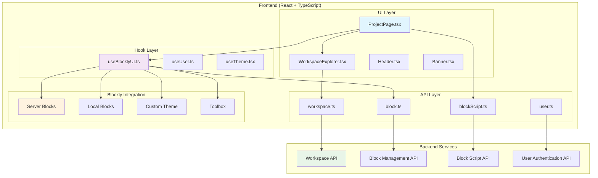
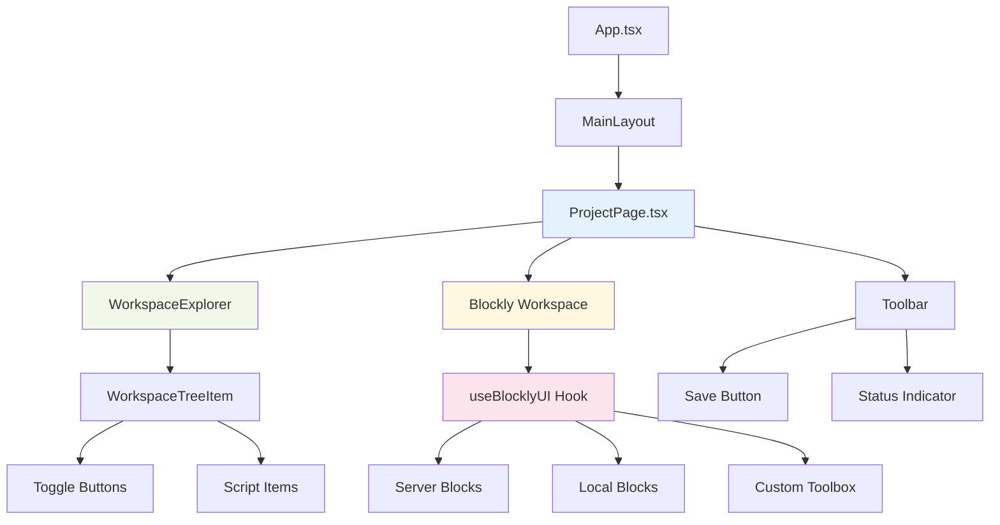
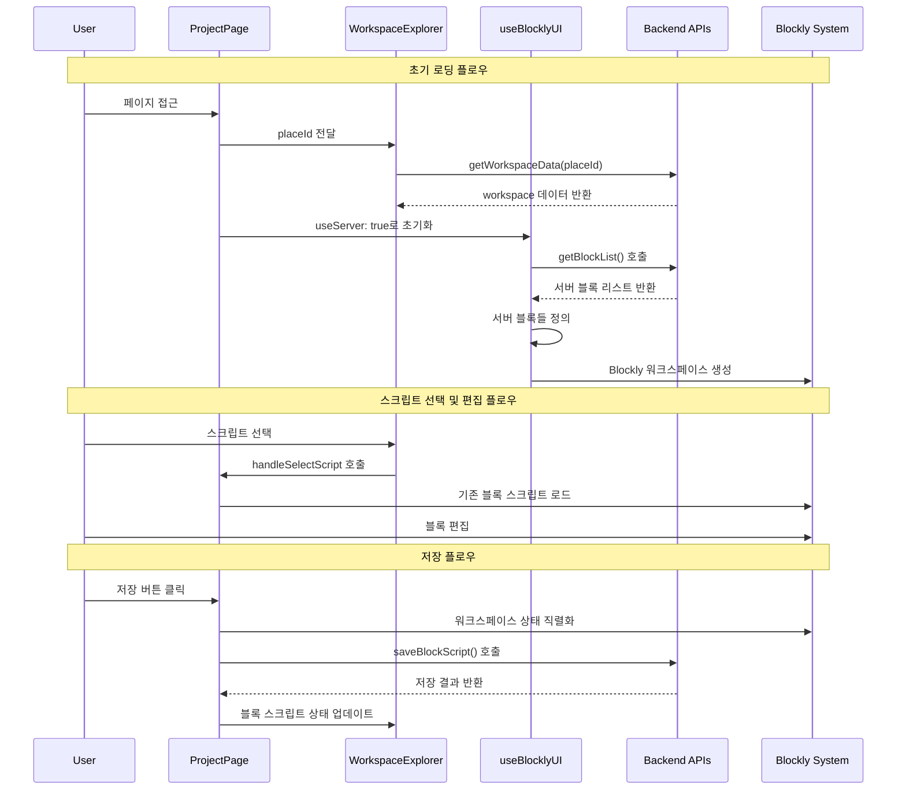
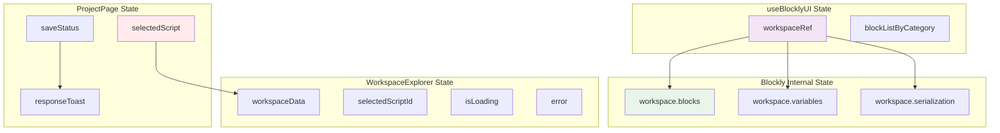
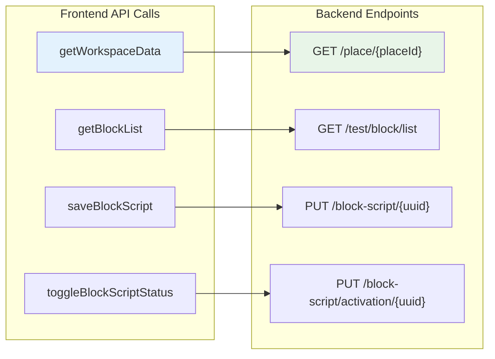
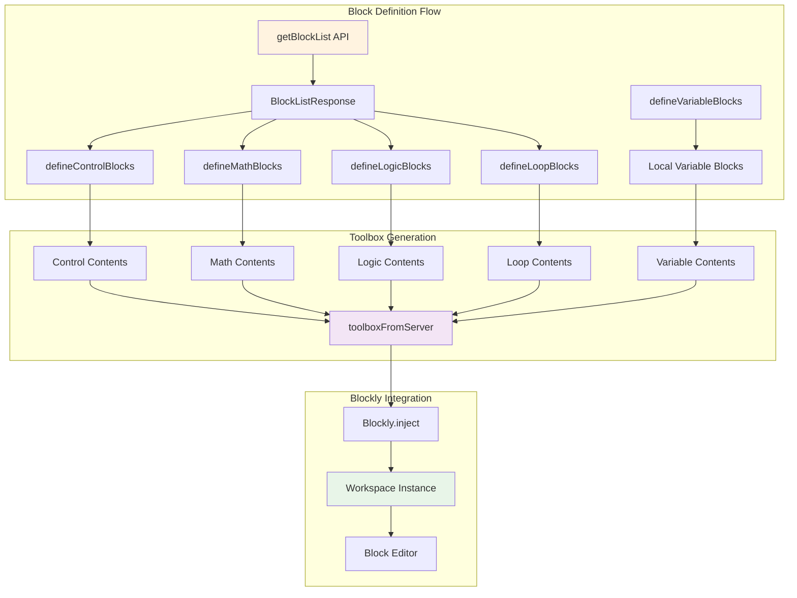

# Roblox Blocky Frontend 아키텍처 구조도

## 전체 시스템 아키텍처

## 컴포넌트 계층 구조

## 데이터 흐름도 (useServer: true 기준)

## 상태 관리 구조

## API 통신 구조 (useServer: true)

## 블록 시스템 아키텍처 (Server Mode)

## 주요 기능별 컴포넌트 매핑

| 기능 | 주요 컴포넌트 | 역할 |
|------|---------------|------|
| 워크스페이스 탐색 | WorkspaceExplorer.tsx | 프로젝트 구조 표시, 스크립트 선택 |
| 블록 편집기 | useBlocklyUI.ts | Blockly 워크스페이스 초기화 및 관리 |
| 블록 정의 | server/block/*.ts | 서버에서 받은 블록 데이터로 블록 정의 |
| 툴박스 구성 | server/toolbox.ts | 서버 블록 기반 툴박스 생성 |
| 스크립트 저장 | ProjectPage.tsx | 블록 상태 직렬화 및 서버 전송 |
| API 통신 | apis/*.ts | 백엔드와의 데이터 교환 |

## 핵심 특징 (useServer: true 모드)

1. **서버 중심 블록 시스템**: 블록 정의를 서버에서 동적으로 받아와 구성
2. **실시간 동기화**: 블록 스크립트 변경사항을 실시간으로 서버에 저장
3. **타입 안전성**: TypeScript를 통한 강타입 시스템 구축
4. **모듈화된 구조**: 도메인별로 분리된 컴포넌트 및 API 구조
5. **상태 관리**: React hooks를 통한 효율적인 상태 관리
